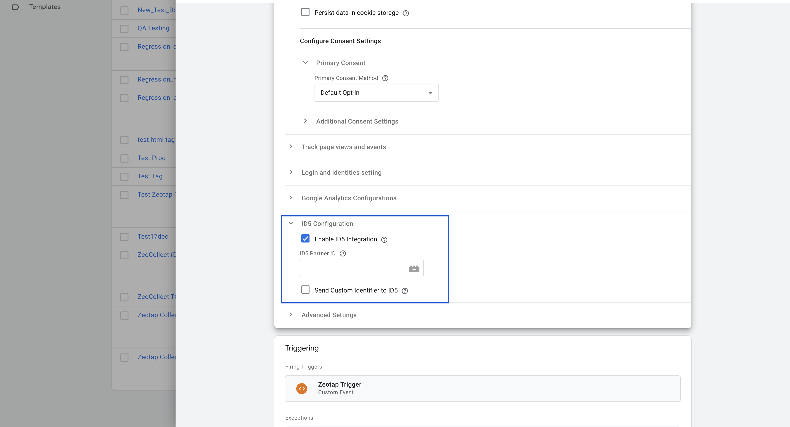

## ID5 Integration in GTM Template

To enable ID5 Universal ID integration via the Zeotap Web SDK GTM template, follow these steps:

1. **Enable ID5**
   - In the template configuration, check the box labeled **Enable ID5**. This will activate the ID5 Universal ID integration in the SDK.

2. **ID5 Partner ID**
   - Enter your specific **ID5 Partner ID** in the provided input field. This is a required numeric value provided by ID5 for your account.

3. **Send Partner Data to ID5 (Optional)**
   - If you want the SDK to send user PII (hashed email/phone) to ID5, check the box labeled **Send Partner Data to ID5**. This option requires that ID5 is enabled. By default, this is not enabled.

### Example Configuration Table

| Option                   | Type    | Description                                                                 |
|--------------------------|---------|-----------------------------------------------------------------------------|
| Enable ID5               | Boolean | Check to enable ID5 Universal ID integration.                               |
| ID5 Partner ID           | Number  | Your unique partner ID from ID5. Required if ID5 is enabled.                |
| Send Partner Data to ID5 | Boolean | (Optional) Check to allow sending hashed PII to ID5. Defaults to unchecked. |

> **Note:** Make sure you have obtained your Partner ID from ID5 before enabling this integration.
